# Cadence

<p align="center">
  
</p>

<p align="center">
  <strong>Hold a key. Say what you mean. Let go.</strong><br />
  Cadence turns it into clean text and puts it wherever your cursor already is.
</p>

<p align="center">
  Windows · Electron · Bring your own API key
</p>


Cadence is push-to-talk voice dictation for Windows. It is not another chat window and it is not
a meeting recorder. You hold a key in any app, speak, release, and the finished text lands at your
cursor. The rough transcript can be cleaned up, corrected, formatted and shaped for the thing you
are writing before it is pasted.

> As building software gets accessible to everyone, more of it will be open-sourced; what people pay for shifts to trust, hosting, support, distribution, and not having to babysit it.

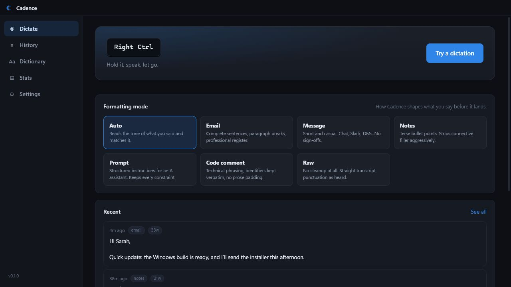

<sub>The screenshots use representative local demo data so no real API key, microphone name or
dictation is exposed. The renderer and controls are the real app.</sub>

---

## What problem this solves

Normal dictation gives you a transcript. That is useful, but it still leaves you editing:

- removing “um”, repeated words and false starts;
- resolving “actually, change that…” corrections;
- turning spoken lists into real lists;
- adding paragraph breaks and punctuation;
- changing a rambling thought into an email, message, note or prompt;
- copying the result into the app where you were already working.

Cadence handles that whole loop:

```text
hotkey down → microphone starts → live waveform
hotkey up   → speech-to-text → optional cleanup → safety gates → Ctrl+V
```

The overlay never takes focus. You can dictate into a browser, editor, Slack, Notepad, a code
review, a terminal prompt or anything else that accepts text.

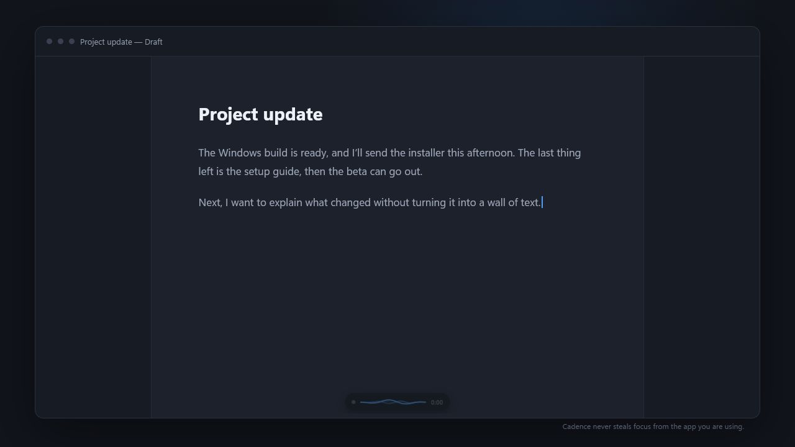

When the text lands, the pill confirms the word count and gets out of the way.

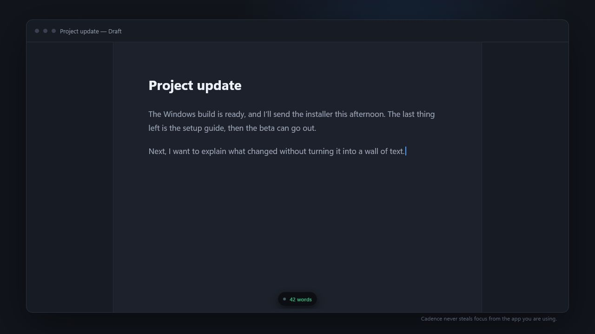

---

## The 60-second version

You need:

1. **Windows 10 or 11.**
2. **Node.js and npm** if you are running from source.
3. **A microphone.**
4. **One OpenAI or Gemini API key** for transcription.
5. Optionally, an Anthropic key if you want Claude to do the cleanup step.

Then:

```powershell
npm install
npm start
```

The first launch walks through the rest.

---

## Install it

### The honest state of the project

There is no signed public installer checked into this repository. The app is ready to run from
source, and the repository contains an NSIS build configuration so you can produce your own
Windows installer.

If you already have a packaged release, install that and skip to
[First launch](#first-launch). Otherwise, use the source route below.

### 1. Install Node.js

Install a current Node.js LTS release from [nodejs.org](https://nodejs.org/). The installer includes
npm.

Open PowerShell and check both commands:

```powershell
node --version
npm --version
```

If both print a version, you are ready.

If PowerShell says `npm.ps1` cannot run because script execution is disabled, use the Windows
launcher directly:

```powershell
npm.cmd --version
```

Use `npm.cmd` in place of `npm` in the commands below. You do not need to change the machine-wide
PowerShell execution policy just to run Cadence.

### 2. Get the code

If you use Git, clone the repository and enter the folder:

```powershell
git clone <repository-url>
cd cadence
```

If you do not use Git:

1. Open the repository page.
2. Choose **Code → Download ZIP**.
3. Extract the ZIP.
4. Open the extracted folder in PowerShell.

The command prompt should be inside the folder that contains `package.json`.

### 3. Install the packages

```powershell
npm install
```

`uiohook-napi` is optional. npm will try to install it because it gives Cadence true key-down and
key-up detection. If that native package cannot install on your machine, the rest of Cadence still
works; use toggle mode or the fallback hold mode.

### 4. Start Cadence

```powershell
npm start
```

For development mode:

```powershell
npm run dev
```

There is no bundler and no front-end build step. The Electron process loads the HTML, CSS and
JavaScript in `src/` directly.

---

## First launch

Cadence starts with a short setup instead of dropping you into a wall of settings.

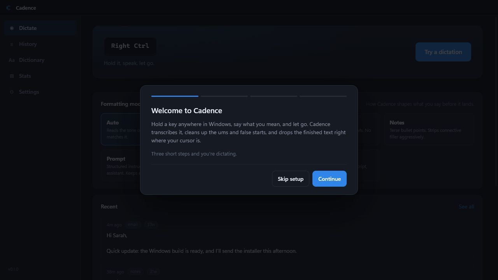

### Step 1: connect a model

Cadence is bring-your-own-key software. Pick the provider, paste a key, then use **Save & test**.
The test happens before you leave setup, so a typo does not wait until your first dictation to
become a mystery.

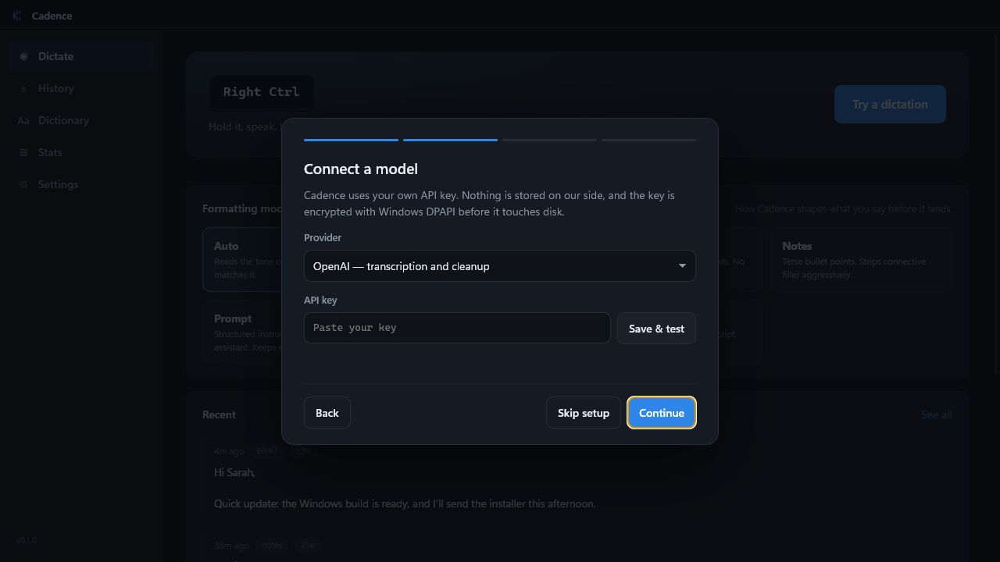

The provider choices are deliberately separate for transcription and cleanup:

| Provider | Transcription | Cleanup | When to pick it |
|---|:---:|:---:|---|
| OpenAI | Yes | Yes | The simplest one-key setup |
| Google Gemini | Yes | Yes | Another complete one-key setup |
| Anthropic / Claude | No | Yes | Use Claude for cleanup, with OpenAI or Gemini for speech |

API key pages:

- [OpenAI API keys](https://platform.openai.com/api-keys)
- [Anthropic API keys](https://console.anthropic.com/settings/keys)
- [Google AI Studio API keys](https://aistudio.google.com/app/apikey)

The model IDs are editable. The lists in Settings are sensible defaults, not a locked catalogue.
The OpenAI base URL is also configurable in the stored settings, so the provider layer can point at
an OpenAI-compatible endpoint.

### Step 2: check the microphone

Pick the input you actually speak into and watch the level meter. Windows may hide device names
until microphone permission has been granted.

Cadence stores both the device ID and the human-readable label. Windows often gives a reconnected
USB microphone a new ID; the label lets Cadence find the same headset again instead of silently
falling back to something else.

### Step 3: learn the hotkey

The ideal default is **Right Ctrl**: hold it, speak, release it. That requires the optional
low-level keyboard hook.

If the hook is unavailable, Cadence uses **Ctrl + Shift + Space** and tells you exactly which
fallback is active. You can switch to toggle mode at any time.

---

## Use it

1. Click where the text should go.
2. Hold the Cadence hotkey.
3. Speak normally. False starts are fine.
4. Release the key.
5. Keep working. Cadence transcribes, cleans, checks and inserts the result.

For example, you can say:

```text
Hey Sarah um quick update the launch is looking good
actually change that the Windows build is ready
and I will send the installer this afternoon
```

With **Email** mode, the result can become:

```text
Hi Sarah,

Quick update: the Windows build is ready, and I’ll send the installer this afternoon.
```

You can also include an instruction in what you say:

```text
The beta is ready, the installer is unsigned, and the docs need one more pass.
Make that a bullet list.
```

The cleanup stage treats “make that a bullet list” as an instruction, not a sentence that belongs
in the final text.

### Cancel a dictation

Press **Escape** while Cadence is listening or processing. The current recording is discarded and
nothing is inserted.

### If an app refuses the paste

Open **Settings → Insertion** and choose one of:

| Method | What it does | Use it when |
|---|---|---|
| Clipboard + Ctrl+V | Copies, pastes, then restores your old clipboard | Normal apps; fastest path |
| Simulate typing | Sends the text as keystrokes | The target blocks synthetic paste |
| Copy only | Leaves the result on the clipboard | You want to paste manually |

---

## Formatting modes

The mode tells the cleanup model what kind of writing you are doing. It is not just a label in the
UI; each mode changes the cleanup system prompt.

| Mode | What comes out |
|---|---|
| **Auto** | Reads the tone and matches it |
| **Email** | Complete sentences, paragraphs and a professional register |
| **Message** | Short, casual chat text without automatic sign-offs |
| **Notes** | Terse bullets with connective filler removed |
| **Prompt** | Structured instructions that preserve every constraint |
| **Code comment** | Technical phrasing with identifiers kept verbatim |
| **Raw** | Straight transcript with no LLM cleanup |

Switch modes from the Dictate screen or the tray. The selected mode is used for the next
dictation.

### Deterministic formatting after the model

The LLM is not trusted to own layout. After cleanup, a rule-based formatter handles the parts that
should not change from one run to the next:

- inline numbered items are broken onto separate lines;
- a lead-in is separated from the first item and given a colon;
- numbered lists are renumbered;
- bullet glyphs are normalised;
- list items are capitalised;
- obvious mic-check repetition is collapsed;
- final punctuation is added when enabled;
- spoken counting such as “one bread, two milk, three bananas” becomes a list only when the shape
  is safely recognisable.

That last constraint matters. “It took two hours” must stay prose. The formatter is conservative on
purpose.

Run its standalone checks without Electron or an API key:

```powershell
npm run test:format
```

---

## History

Cadence keeps the most recent 500 dictations by default. History stores the polished result and the
raw transcript side by side, which makes failures visible and gives you a way back to your exact
words.

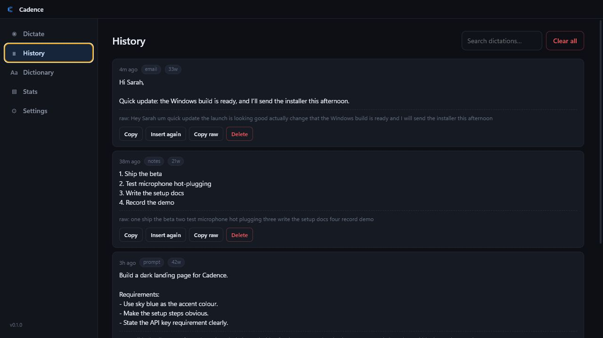

From each history entry you can:

- copy the cleaned result;
- insert it again into the current app;
- copy the raw transcript;
- delete the entry;
- see the formatting mode and word count;
- see when the safety gate chose the raw transcript instead of the cleanup output.

Search looks through both the raw and cleaned text.

---

## Dictionary

Use the dictionary for names, project vocabulary, acronyms and the terms speech models repeatedly
mishear.

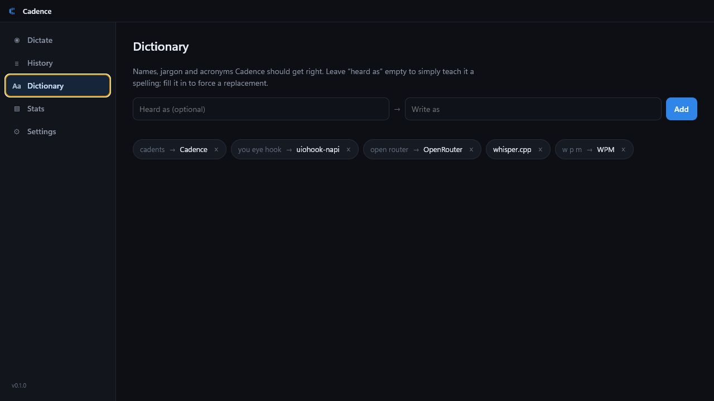

There are two kinds of entry:

```text
Write as: whisper.cpp
```

This biases the transcription and cleanup prompts toward the spelling.

```text
Heard as: you eye hook
Write as: uiohook-napi
```

This also runs as a deterministic replacement after cleanup, so the final spelling does not depend
on the model making the same decision every time.

---

## Stats

Stats are local and intentionally simple: words dictated, dictation count, average and best WPM,
day streak, estimated time saved against typing at 40 WPM, and a 30-day activity strip.

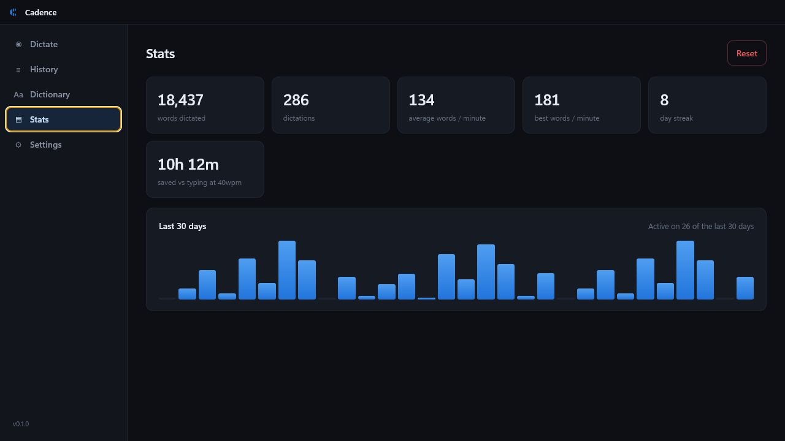

There is no account, leaderboard, analytics service or telemetry behind this screen. It is a local
JSON file.

---

## Settings, without the scavenger hunt

### API keys and providers

Keys can be saved, replaced, tested or removed independently. The UI only receives a masked hint;
the full key never crosses into the renderer.

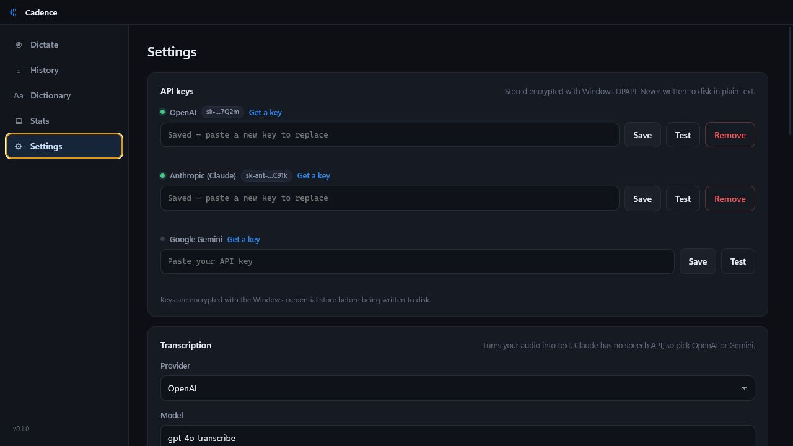

Transcription and cleanup can use different providers. A useful setup is:

```text
OpenAI gpt-4o-transcribe → Claude Haiku cleanup
```

If cleanup fails or its key is missing, Cadence keeps going with the raw transcript. Cleanup is a
nicety; losing the words you just spoke is not.

### OpenAI-compatible endpoints

The provider layer reads `openaiBaseUrl` from the local settings file. To use an
OpenAI-compatible gateway or local server:

1. Quit Cadence from the tray.
2. Open `%APPDATA%\Cadence\settings.json`.
3. Change `openaiBaseUrl`.
4. Start Cadence and enter that endpoint’s key in the OpenAI key row.
5. Type the endpoint’s model ID into the model field.

This is an advanced configuration; there is not a base-URL field in the current Settings screen.

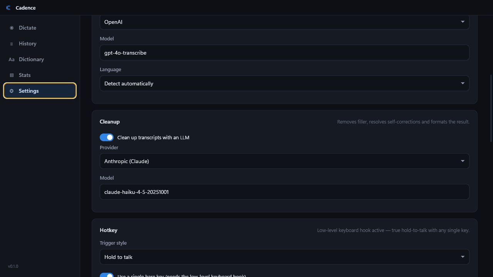

### Hotkey and insertion

Cadence reports the hotkey tier that is actually active. It does not pretend a fallback is the
same as a real key-up hook.

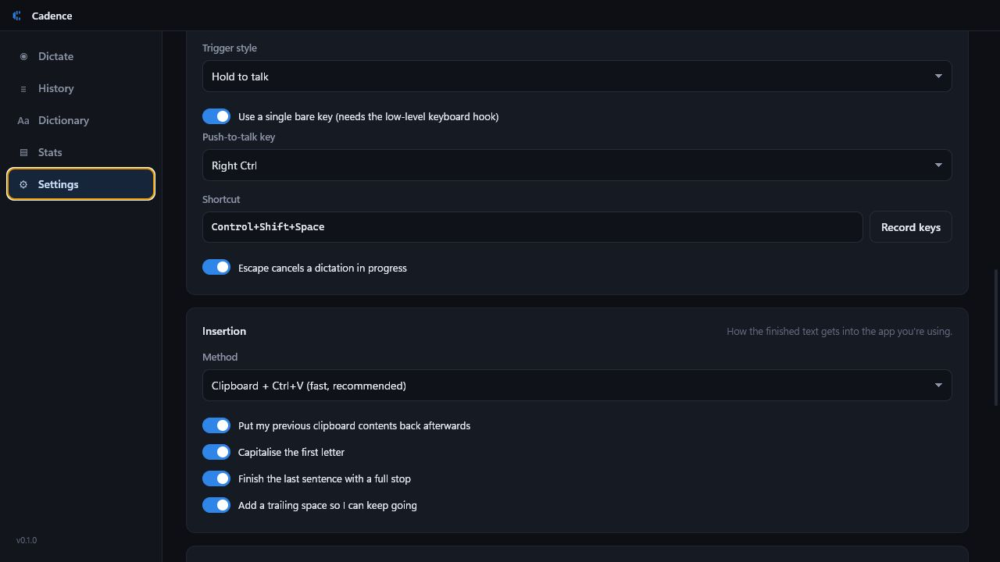

### Microphone and system behaviour

The microphone panel shows the selected input, the input that is really open, a live meter and the
minimum recording length. Very short taps are ignored instead of being uploaded as empty audio.

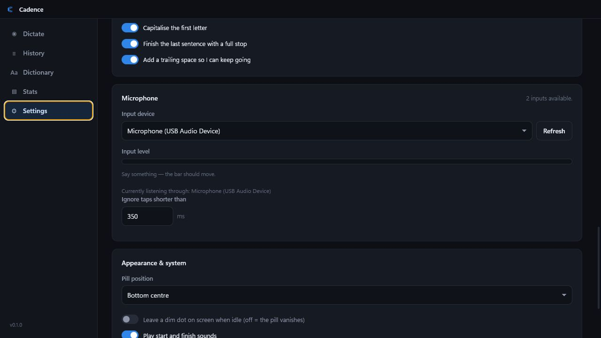

You can also choose the pill position, sounds, launch-at-login behaviour, start-minimised behaviour
and whether a dim idle dot remains on screen.

---

## Hotkeys on Windows, honestly

Electron’s `globalShortcut` API gives a key-down event, not a key-up event, and it cannot register a
bare modifier such as Right Ctrl. Cadence has three operating tiers:

| Tier | Behaviour | Tradeoff |
|---|---|---|
| `uiohook` | True key-down/key-up; single keys work | Depends on the optional native module |
| Hold fallback | Accelerator repeats while held; a watchdog detects release | Very short releases can be noticed up to roughly 0.7 seconds late |
| Toggle | Press once to start, once to stop | Exact and dependable, but not hold-to-talk |

If `npm install` cannot build the optional hook, nothing else is lost. Open
**Settings → Hotkey**, choose toggle mode, and carry on.

---

## What happens to one dictation

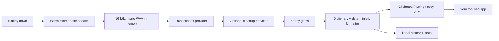

The recorder lives in a hidden Electron window so the microphone stream can stay warm. The
overlay is a separate, non-focusable window. The settings/history UI is a third window. Each has
one job.

Captured audio is encoded as 16 kHz mono WAV in memory. It is uploaded once when you release the
hotkey. Cadence does not write recordings to its data folder.

### Why WAV instead of MediaRecorder output

Chromium’s `MediaRecorder` reliably produces WebM/Opus, which does not fit every configured
provider. A tiny local PCM-to-WAV encoder gives every transcription backend the same input without
adding an audio dependency.

### Cleanup safety gates

An LLM asked to edit text will occasionally answer it, wrap it in commentary, expand it wildly or
return almost nothing. Cadence rejects the cleanup result and uses the raw transcript when:

- the output is empty;
- it grows beyond 2.4× the raw word count;
- it shrinks below 35% of the raw word count;
- it contains prompt-leak markers such as “Here is the”, “Sure,” or a code fence;
- the raw input is two words or shorter and does not need cleanup.

The history entry is tagged `raw` and records the reason. Failure is visible instead of silent.

---

## Privacy and security

Cadence has no backend of its own and no telemetry.

What leaves the machine:

1. The in-memory audio buffer goes to the transcription provider you selected.
2. If cleanup is enabled, the transcript goes to the cleanup provider you selected.

What stays local:

- settings;
- dictation history;
- dictionary entries;
- usage stats;
- encrypted API key blobs.

API keys are encrypted with Electron `safeStorage`, which uses Windows DPAPI and is scoped to your
Windows user. If OS encryption is unavailable, Cadence refuses to save a key instead of quietly
writing it as plaintext.

Every renderer uses:

```text
contextIsolation: true
nodeIntegration: false
```

The renderer only sees the narrow API exposed by its preload bridge. It never receives an API key;
it receives a hint such as `sk-…4f2a`.

### Local data folder

Cadence stores its local files in:

```text
%APPDATA%\Cadence\
```

| File | Contains |
|---|---|
| `settings.json` | Provider, model, hotkey, microphone and behaviour settings |
| `secrets.json` | DPAPI-encrypted API key blobs |
| `history.json` | Raw and cleaned dictation text |
| `dictionary.json` | Custom vocabulary and replacements |
| `stats.json` | Local counters and daily activity |

Use **Settings → Open data folder** to jump there.

---

## Tray behaviour

Cadence is designed to disappear into the tray once it is configured. The tray menu gives direct
access to:

- Dictate;
- formatting mode;
- microphone selection;
- Settings;
- API keys;
- Quit.

Starting minimised does not disable the hotkey or microphone warm-up. It only keeps the hub window
closed.

---

## Build an installer

Create an unpacked application directory:

```powershell
npm run pack
```

Create the Windows NSIS installer:

```powershell
npm run dist
```

Output is written to `dist/`.

The installer is unsigned. Windows may show a reputation warning for a build that has not been
code-signed. That is expected for the current project; it is not hidden in a footnote.

---

## Project layout

```text
src/
├─ shared/
│  ├─ channels.js          IPC channel names
│  └─ defaults.js          settings, modes and model catalogue
├─ main/
│  ├─ main.js              lifecycle and boot order
│  ├─ windows.js           hub, overlay and recorder windows
│  ├─ tray.js              tray icon and menu
│  ├─ hotkey.js            three-tier push-to-talk manager
│  ├─ paste.js             clipboard, Ctrl+V and typing injection
│  ├─ session.js           dictation state machine
│  ├─ store.js             atomic JSON storage and encrypted secrets
│  ├─ history.js           capped dictation history
│  ├─ stats.js             counters, streak and activity
│  ├─ dictionary.js        vocabulary and forced replacements
│  └─ providers/
│     ├─ index.js          provider routing
│     ├─ openai.js         OpenAI transcription and cleanup
│     ├─ anthropic.js      Claude cleanup
│     ├─ gemini.js         Gemini transcription and cleanup
│     ├─ prompt.js         cleanup prompt by formatting mode
│     ├─ guards.js         cleanup sanity gates
│     └─ format.js         deterministic layout pass
├─ preload/
│  ├─ hub.js               hub bridge
│  ├─ overlay.js           pill bridge
│  └─ recorder.js          microphone bridge
└─ renderer/
   ├─ hub/                 Dictate, History, Dictionary, Stats, Settings
   ├─ overlay/             floating status pill
   └─ recorder/            hidden microphone owner
```

[`PLAN.md`](PLAN.md) contains the full architecture notes and the reasoning behind the difficult
Windows-specific decisions.

---

## Development

### Commands

| Command | Purpose |
|---|---|
| `npm start` | Run the app |
| `npm run dev` | Run Electron with the development flag |
| `npm run test:format` | Test deterministic text formatting in plain Node |
| `npm run pack` | Build an unpacked app directory |
| `npm run dist` | Build a Windows NSIS installer |

### There is intentionally very little machinery

- no React;
- no Vite or Webpack;
- no runtime database;
- no required native dependency;
- no SDK dependency for provider HTTP calls;
- no image package for the generated tray icon.

Electron and Node already provide `fetch`, `FormData`, `Blob`, `safeStorage`, IPC, windows and the
clipboard. Plain HTML, CSS and JavaScript are enough for the UI here.

### Add another provider

The provider boundary is small:

1. Add `src/main/providers/<provider>.js`.
2. Implement `transcribe()` if the provider accepts audio.
3. Implement `clean()` if it can perform the cleanup stage.
4. Implement `test()` for the Settings button.
5. Register the provider in `src/main/providers/index.js`.
6. Add models and labels in `src/shared/defaults.js`.
7. Add its key row and validation rules.

The session state machine should not need provider-specific branches.

### Change the formatter

The formatter owns only mechanically decidable layout. Meaning belongs to the transcription and
cleanup stages. If a rule cannot tell prose from a list with conservative guard rails, it probably
does not belong in `format.js`.

Add a case to `tools/format-check.js`, then run:

```powershell
npm run test:format
```

---

## Troubleshooting

### Cadence opens, but dictation cannot start

Open **Settings → API keys** and test the key used by the transcription provider. Transcription
needs an OpenAI or Gemini key. An Anthropic key alone cannot turn audio into text.

### The hotkey does nothing

Another app may already own the shortcut.

1. Open **Settings → Hotkey**.
2. Choose another accelerator or record one.
3. If the low-level hook is unavailable, turn off the single bare key option.
4. Try toggle mode.

The status sentence at the top of the Hotkey panel tells you which tier is live.

### Releasing the key feels late

You are probably on the hold fallback, which uses keyboard auto-repeat and a watchdog because
Electron does not provide key-up. Install the optional hook successfully or use toggle mode for
exact start and stop events.

### Cadence listens to the wrong microphone

Open **Settings → Microphone**, choose the input, speak, and watch the live meter. The line
“Currently listening through…” reports the device that was really opened, not merely the saved
choice.

If a USB microphone was reconnected, press **Refresh**. Cadence will try to resolve the saved
device by label.

### Microphone names are blank

Allow desktop apps to access the microphone in Windows privacy settings, then return to Cadence and
press **Refresh**. Chromium cannot reveal labels before permission is granted.

### Text reaches the clipboard but not the app

Some applications reject synthetic Ctrl+V.

1. Open **Settings → Insertion**.
2. Try **Simulate typing**.
3. If that still fails, use **Copy only** and paste manually.

### The result was marked `raw`

The cleanup call failed, the cleanup key was missing, or a safety gate rejected the model output.
Open History and hover the `raw` tag for the reason. Your transcription was kept instead of being
discarded.

### A quick tap does nothing

That is intentional. Recordings shorter than the configured minimum, 350 ms by default, are treated
as accidental taps and are not uploaded. Change the threshold in **Settings → Microphone**.

### `npm install` reports an error for `uiohook-napi`

The module is optional. If npm completed the rest of the install, run Cadence and use toggle mode.
You can retry optional packages later with:

```powershell
npm install --include=optional
```

### PowerShell says `npm.ps1` cannot be loaded

Call npm through its Windows command launcher:

```powershell
npm.cmd install
npm.cmd start
```

This bypasses the blocked PowerShell wrapper without changing the system execution policy.

### The installer triggers a Windows warning

The current installer is unsigned. A reputation warning is expected until builds are code-signed.
If you did not build it yourself, verify where it came from before running it.

---

## Current limitations

- **Windows only in practice.** Text injection uses PowerShell and Windows Forms.
- **Cloud transcription only.** A local `whisper.cpp` provider would fit the existing interface,
  but it is not implemented.
- **No streaming partial transcript.** Audio uploads once when you release the key.
- **Unsigned installer.**
- **No account sync.** History, settings, dictionary and stats live on one Windows profile.

These are actual v1 boundaries, not items hidden behind “coming soon”.

---

## FAQ

### Does Cadence save audio recordings?

No. The recording is held in memory long enough to send to the selected transcription provider.
History stores text and metadata, not audio.

### Can I turn cleanup off?

Yes. Disable **Clean up transcripts with an LLM** or use **Raw** mode.

### Can transcription and cleanup use different companies?

Yes. They are separate settings by design.

### Can I use Claude for transcription?

No. Anthropic does not provide the speech-to-text stage used here. Use OpenAI or Gemini for
transcription and Claude for cleanup.

### Can I use it without the low-level keyboard hook?

Yes. Use the accelerator fallback or toggle mode.

### Can I keep my clipboard unchanged?

Yes. Clipboard + Ctrl+V captures the previous clipboard and restores it after insertion. You can
turn restoration off.

### Why does History keep the raw text?

Because cleanup is probabilistic. The raw transcript is the audit trail and the escape hatch.

### Is there telemetry?

No.

---

## Contributing

Small, focused changes fit this project best.

1. Create a branch.
2. Run the app before changing it.
3. Keep renderer access behind the preload bridge.
4. Keep provider-specific code inside `src/main/providers/`.
5. Add formatter cases to `tools/format-check.js`.
6. Run `npm run test:format`.
7. Explain any Windows-specific tradeoff plainly in the pull request.

Please do not add a framework or native dependency to solve a problem that the platform already
solves cleanly. The small dependency surface is part of the product.

---

## License

This repository does not currently include a software license.

Cadence is an independent, from-scratch implementation of the push-to-talk dictation workflow. It
is not affiliated with, endorsed by or derived from another product.
